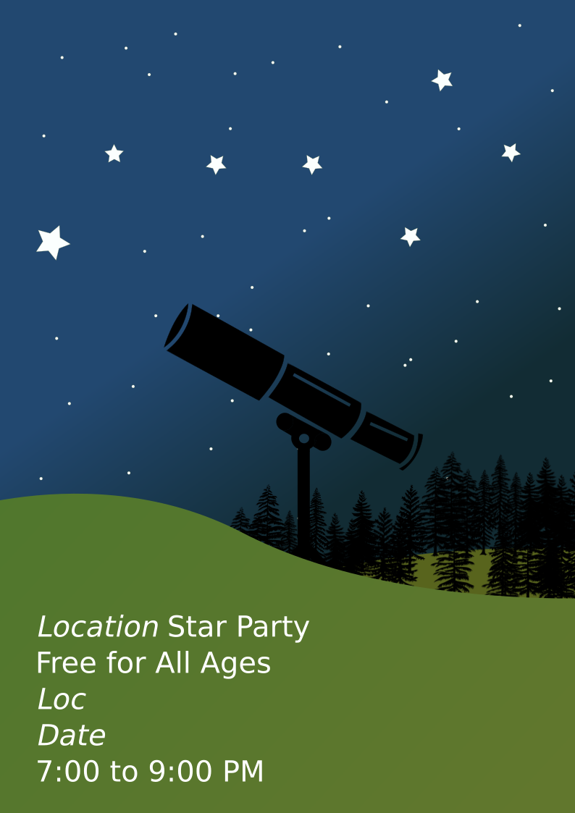

# OpenStarPartyPoster
 A free star party poster design for astronomy outreach🔭

<!-- PROJECT SHIELDS -->
<!--
*** I'm using markdown "reference style" links for readability.
*** Reference links are enclosed in brackets [ ] instead of parentheses ( ).
*** See the bottom of this document for the declaration of the reference variables
*** for contributors-url, forks-url, etc. This is an optional, concise syntax you may use.
*** https://www.markdownguide.org/basic-syntax/#reference-style-links
-->
[![Contributors][contributors-shield]][contributors-url]
[![Forks][forks-shield]][forks-url]
[![Stargazers][stars-shield]][stars-url]
[![MIT License][license-shield]][license-url]

<!-- PROJECT LOGO -->
 

  

  <h3 align="center">Open Source Star Party Poster</h3>

  

    A free star party poster design for astronomy outreach. :telescope: 
  

<!-- TABLE OF CONTENTS -->

  
<h2 style="display: inline-block">Table of Contents</h2>

  <ol>
    <li>
      <a href="#about-the-project">About The Project</a>
      <ul>
        <li><a href="#built-with">Built With</a></li>
      </ul>
    </li>
    <li><a href="#design">Design</a></li>
    <li><a href="#license">License</a></li>
    <li><a href="#contact">Contact</a></li>
    <li><a href="#acknowledgements">Acknowledgements</a></li>
  </ol>

<!-- ABOUT THE PROJECT -->
## About The Project

I needed a poster design and just couldn't find a good one on the web. I designed this one in Inkscape, and figured I would share.  

Editing the poster is easy! Just open in Inkscape, double click the text box, and fill in the information. There is area on the right side to add in your area logos or symbols if you are a school, university, or city as well! Simply import your image and drag it to the corner. 

### Built With

* [Inkscape](www.inkscape.org)

<!-- LICENSE -->
## License

Distributed under the GPL_V3 License. See `LICENSE` for more information.

<!-- CONTACT -->
## Contact

Liam Plybon - lplybon1@gmail.com

Project Link: [https://github.com/blablabliam/OpenStarPartyPoster](https://github.com/blablabliam/OpenStarPartyPoster)

Like it enough to spend money? Don't feel pressured. 

<!-- ACKNOWLEDGEMENTS -->
## Acknowledgements

Doyeon Kim for inspiration.
* [Inkscape](www.inkscape.org)

<!-- MARKDOWN LINKS & IMAGES -->
<!-- https://www.markdownguide.org/basic-syntax/#reference-style-links -->
[contributors-shield]: https://img.shields.io/github/contributors/blablabliam/OpenStarPartyPoster.svg?style=for-the-badge
[contributors-url]: https://github.com/blablabliam/OpenStarPartyPoster/graphs/contributors
[forks-shield]: https://img.shields.io/github/forks/blablabliam/OpenStarPartyPoster.svg?style=for-the-badge
[forks-url]: https://github.com/blablabliam/OpenStarPartyPoster/network/members
[stars-shield]: https://img.shields.io/github/stars/blablabliam/OpenStarPartyPoster.svg?style=for-the-badge
[stars-url]: https://github.com/blablabliam/OpenStarPartyPoster/stargazers
[issues-shield]: https://img.shields.io/github/issues/blablabliam/OpenStarPartyPoster.svg?style=for-the-badge
[issues-url]: https://github.com/blablabliam/OpenStarPartyPoster/issues
[license-shield]: https://img.shields.io/github/license/blablabliam/OpenStarPartyPoster.svg?style=for-the-badge
[license-url]: https://github.com/blablabliam/OpenStarPartyPoster/blob/master/LICENSE.txt